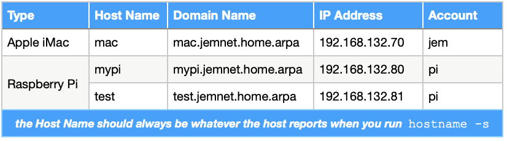
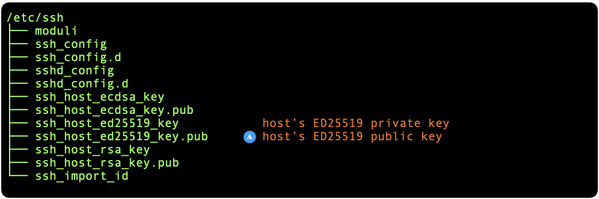
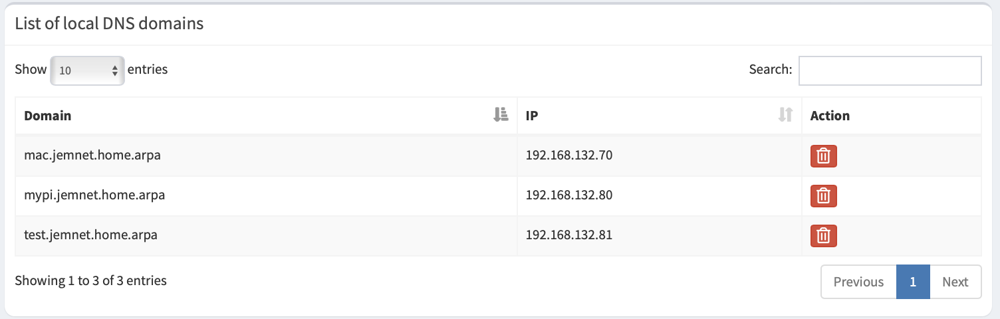
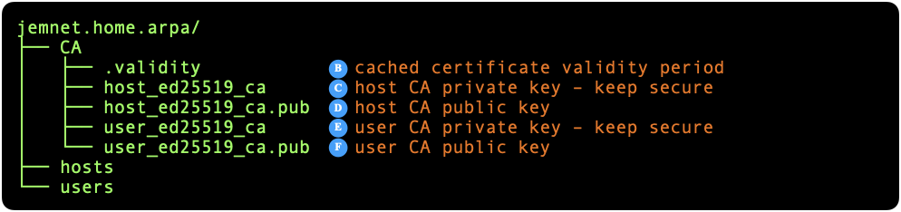
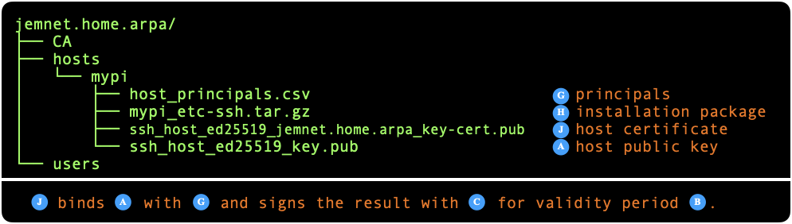
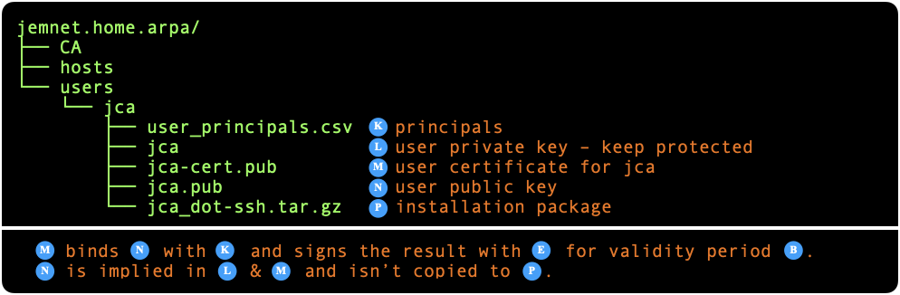
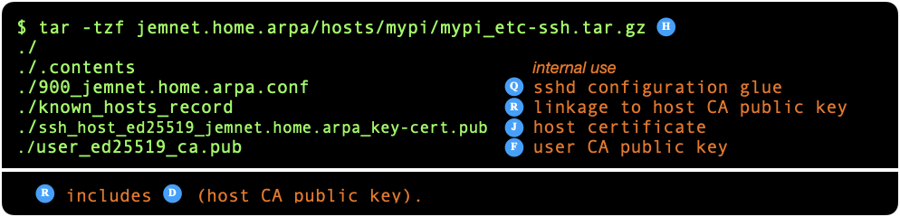
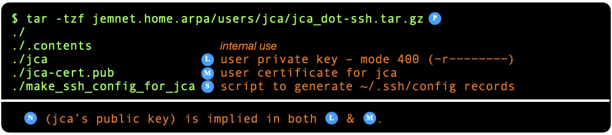
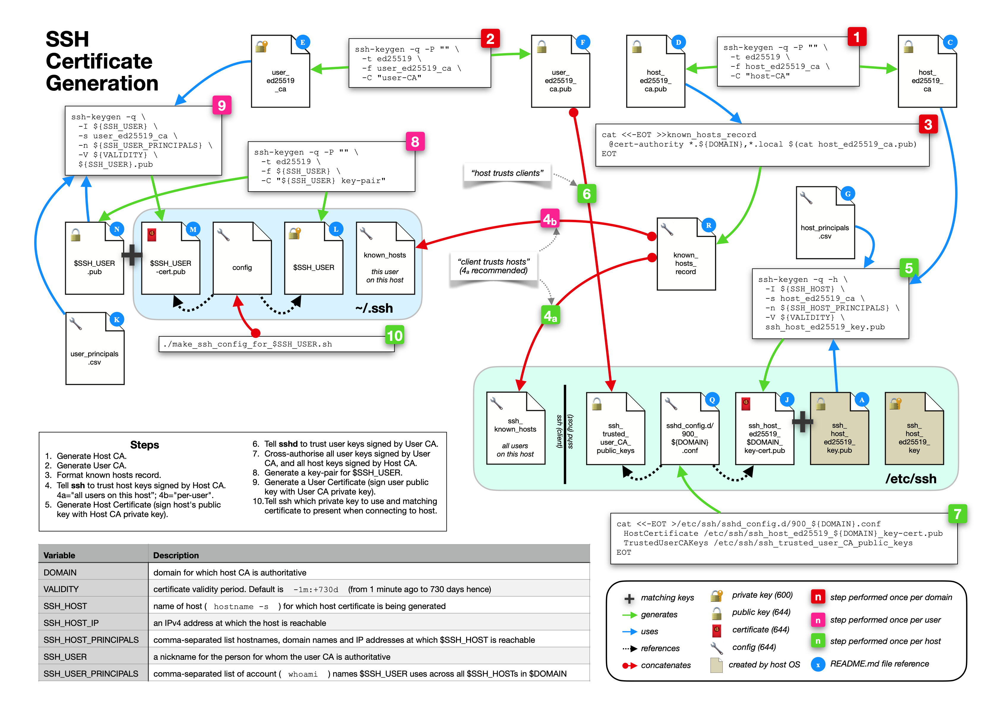

# Generating SSH certificates

## contents

- [background](#background)
- [scenario](#scenario)
- [terminology](#terminology)

	- [Public Key Algorithms](#aboutAlgorithms)
	- [SSH User](#aboutSSHuser)
	- [Certificate Authority](#aboutCAs)
	- [Certificate](#aboutCerts)

- [on the subject of a Domain](#onDomain)
- [on the subject of a DNS server](#onDNSserver)
- [overview of the process](#processSummary)
- [tutorial](#tutorial)

	- [create Certificate Authorities](#makeCAsStep)
	- [create host certificate](#makeHostsStep)
	- [create user certificate](#makeUsersStep)
	- [install host certificate](#installHostsStep)
	- [install user certificate](#installUsersStep)
	- [make configuration record](#installConfigStep)
	- [the acid test](#acidTestStep)
	- [the next host](#nextHostStep)

- [scripts reference](#scriptsReference)

	- [make SSH CAs for domain](#makeCAsCommand)
	- [make SSH certificate for host](#makeHostCertCommand)
	- [make SSH certificate for user](#makeUserCertCommand)
	- [install SSH host package](#installHostCommand)
	- [install SSH user package](#installUserCommand)
	- [make configuration record for SSH user](#makeConfigCommand)

		- [condensed notation](#makeConfigCondensed)

- [useful commands](#usefulCommands)
- [the big picture](#theBigPicture)

<a name="background"></a>
## background

The first time you used SSH to connect to a computer, you probably typed commands like:

``` console
$ ssh account@host.domain`
```

That produced a scary-looking warning which security gurus call the "Trust On First Use" or "TOFU" pattern:

```
The authenticity of host 'host.domain' can't be established.
ED25519 key fingerprint is SHA256:VA8GkmADPpDCD2kOZ595uawSa+6oXwHUDRg4FOoWR1o.
This key is not known by any other names.
Are you sure you want to continue connecting (yes/no/[fingerprint])? 
```

You typed "yes" and were prompted for the account password on the target host, after which you were logged-in. The second time you connected to the same host, you didn't get the TOFU warning and, generally, things stayed that way unless something changed.

For a lot of people, their SSH journeys end at that point. However, if you ever needed password-less login, you would've learned how to use `ssh-keygen` to generate key-pairs and `ssh-copy-id` to move your keys around. You likely also learned how to set up entries in `~/.ssh/config` so that you could reduce your SSH commands to just:

``` console
$ ssh host
```

Thereafter, each time you added a new host to your home network, you had to revisit that basic process. At some point you might've wondered about alternatives and you may well have seen hints about using "SSH certificates". Googling the topic would have led you to tutorials but, if your experience was anything like mine, the whole thing screamed "complexity" so you put everything back in its box.

SSH certificates *are* a bit complicated. But complex problems can often be simplified. And that's what the scripts in this repository are intended to do.

<a name="scenario"></a>
## scenario

Jemima Chapman Appleseed operates a small home network consisting of a SOHO router provided by her ISP, an iMac and two Raspberry Pis. Jem runs [Pi-hole](https://pi-hole.net) on her `mypi` host and uses it to resolve the domain names shown in [Table&nbsp;1](#table1). Jem's goal is to set up a scheme of SSH certificates so that she can SSH from any host to any other host, password-free.

| <a name="table1"></a>Table 1: Hosts on Jem's Home Network |
|:---------------------------------------------------------:|
|  |

<a name="terminology"></a>
## terminology

Getting a grip on the terminology is well over half the battle so *please* take the time to do that.

<a name="aboutAlgorithms"></a>
### Public Key Algorithms

SSH supports a bunch of Public Key Cryptography algorithms. You can get a complete list by running:

``` console
$ ssh -Q HostKeyAlgorithms
```

The first time you boot a fresh installation of an operating system (eg Linux, macOS) on a computer, SSH generates key-pairs for a subset of its supported algorithms (usually RSA, ECDSA and ED25519) and places the files in `/etc/ssh`. [Figure&nbsp;1](#fig-etc-ssh) shows the typical initial directory structure:

| <a name="fig-etc-ssh"></a>Figure 1: Default file structure – /etc/ssh    |
|:------------------------------------------------------------------------:|
| |

Each file prefixed with `ssh_host_` is a member of a key-pair. The `.pub` extension denotes the public key, the other file being the private key. The *content* of each key-pair is unique to the host on which it was generated.

The SSH algorithm that is currently recommended by security gurus is "ssh-ed25519" and that's what the scripts in this repository use. <!--A-->&#x1F130; marks the host's public key for the ED25519 algorithm. You will see this file used later.

<a name="aboutSSHuser"></a>
### SSH User

Please study [Table&nbsp;1](#table1) again and focus on the "Account" column and note that Jem logs-in to her computers as both `jem` and `pi`. If you think about it, there's a distinction between Jem (the person) and the account names she uses.

This tutorial uses the term *"SSH&nbsp;user"* to represent the **person**. Although there is no reason why we couldn't re-use either "jem" or "pi" as Jem's *SSH&nbsp;user* name, we are going to use Jem's initials ("jca") to help keep this distinction between *person* and *account* clear.

<a name="aboutCAs"></a>
### Certificate Authority

A Certificate Authority ("CA") is just an ordinary public and private key-pair where the private key is only ever used to sign certificates. We'll get to "certificates" in a moment.

You need two Certificate Authorities:

* one for your hosts (the "host&nbsp;CA"); and
* one for your users (the "user&nbsp;CA").

A certificate authority's **public** key can be used to verify that a **certificate** was signed by the certificate authority's **private** key. In other words:

* verifying a host certificate with the host CA's public key provides **users** with an assurance that the host is the one they intend to reach; while
* verifying a user certificate with the user CA's public key provides **hosts** with an assurance that the SSH&nbsp;user is authorised to have access to the host.

Please read that last dot-point again. The assurance being given to the host is about the SSH&nbsp;user (ie the person), not the account which is being used to communicate with the host via the SSH protocol. It's a subtle but important distinction.

<a name="aboutCerts"></a>
### Certificate

A certificate is the result of binding a public key with a list of "principals", then signing that pairing with a Certificate Authority's private key. There are two types of certificate:

* <a name="hostCert"></a>**host certificate**

	The "principals" for a host certificate are a list of the network addresses via which the host is reachable. Think of it like this. Given the basic command:

	``` console
	$ ssh account@«address»
	```

	then `«address»` might be any of the following:

	* the host's IP address (eg 192.168.132.70)
	* the name of the host (eg mac)
	* the host's domain name (eg mac.jemnet.home.arpa)
	* the host's multicast domain name (eg mac.local).

	The "principals" are a comma-separated list of those network addressing mechanisms:

	```
	192.168.132.70,mac,mac.jemnet.home.arpa,mac.local
	```

	A host certificate binds the principals with the host's ED25519 public key, then signs the certificate with the private key of your host&nbsp;CA.

	Any *client* system in possession of *the public key for your host&nbsp;CA* can authenticate the certificate and be certain that the host is what it claims to be.

	Note the words *"the public key for your host&nbsp;CA".* This is not the same as each host's public key. The *single* public key for your host&nbsp;CA authenticates the separate certificates for **all** of your hosts.

* **user certificate**

	The scripts begin by generating an ED25519 public and private key-pair for each *SSH&nbsp;user*.

	> This is unlike the situation with host certificates where the host's ED25519 key-pair (see [Figure&nbsp;1](#fig-etc-ssh)) is generated automatically the first time the host boots up.

	The "principals" for a user certificate are a comma-separated list of the account names that the *SSH&nbsp;user* uses across all hosts in the domain. From [Table&nbsp;1](#table1) we can determine that that list is:

	```
	jem,pi
	```

	A user certificate binds the principals (the list of account names) with the *SSH&nbsp;user's* ED25519 public key, then signs the certificate with the private key of your user&nbsp;CA.

	Any *server* system in possession of *the public key for your user&nbsp;CA* can authenticate the certificate and be certain that the user is who he or she claims to be.

	Note the words *"the public key for your user&nbsp;CA".* This is not the same as each user's public key. The *single* public key for your user&nbsp;CA authenticates **all** your *SSH&nbsp;users*.

This notion of a *single* public key to authenticate *all* certificates signed by the corresponding private key is what makes "SSH Certificates" so powerful. If you add a new host to your network and generate a certificate for it, you don't have to visit all the other hosts in your network to tell them about the new certificate. Your other hosts already have your host&nbsp;CA's public key so the certificate for the new host can be authenticated without further ado. The same if you define a new SSH&nbsp;user. All your hosts already have your user&nbsp;CA's public key so they can authenticate the new user certificate.

To put this another way, using `ssh-keygen` to generate per-user keys and `ssh-copy-id` to move keys around, gives you a full-mesh or O(n<sup>2</sup>) problem: you have to do increasing amounts of work each time you add a new host or user. Conversely, SSH certificates are an O(n) problem.

The one weakness of this scheme is that if Jem ever decides to invent a new account name for one of her hosts, she is forced to regenerate her user certificate to add that account name to the list of principals, and then deploy the updated certificate into the `~/.ssh` directory on all of her accounts.

<a name="onDomain"></a>
## on the subject of a Domain

You *will* need a domain but that doesn't mean you have to register and pay for a domain. If you already own a domain, use it. Otherwise, you can either invent a domain or you can adopt the `home.arpa` domain which is reserved by [RFC8375](https://datatracker.ietf.org/doc/html/rfc8375) for exactly this kind of situation.

If you decide to use `home.arpa`, I'd recommend inventing your own sub-domain such as the one Jemima has chosen:

```
jemnet.home.arpa
```

<a name="onDNSserver"></a>
## on the subject of a DNS server

Although Jemima is running Pi-hole, that doesn't mean that you must have a Domain Name System server. SSH certificates work just as well with IP addresses or hostnames in `/etc/hosts`. You can also enable multicast DNS services on your hosts and rely on the `.local` domain.

That said, you will have a better user experience with a DNS server than without. PiHole is easy to spin-up and adding a DNS record is a matter of typing each host's fully-qualified domain name plus its IP address, and clicking <kbd>Add</kbd>. [Table&nbsp;2](#table2) is a screen shot of Jem's PiHole DNS page.

| <a name="table2"></a>Table 2: Jem's Home Network - PiHole DNS  |
|:--------------------------------------------------------------:|
| |

<a name="processSummary"></a>
## overview of the process

Setting up a scheme of personal SSH certificates boils down to:

1. Run a script to create two Certificate Authorities ("CA"), one for your hosts (the "host&nbsp;CA") and another for your users (the "user&nbsp;CA"). You typically run this script exactly once.

2. Run a script for each of your hosts.

	SSH has already done the work of setting up an ED25519 public and private key-pair for the host. All the script has to do is to create the host certificate and sign it with your host&nbsp;CA.

3. Run a script for each SSH&nbsp;user identity you want to create.

	Initially, this will just be you but you can also create identities for members of your family if that's what you want to do. The script generates a public and private key-pair for each SSH&nbsp;user, then creates a certificate which is signed by your user&nbsp;CA.

4. Run a script to install the host's certificate on the host for which it was generated.

5. Run a script to install the user's certificate on each host where the user has an account.

6. Run a script to generate a host record for your `~/.ssh/config`. This is actually an optional step but a host record provides the glue that lets you connect to a host just by running the command:

	``` console
	$ ssh host
	```

If you ever used `ssh-keygen` and `ssh-copy-id` to set up password-less login, most of this will sound pretty familiar, and that's a reasonable observation. **But,** once your certificate scheme is set up, adding a new host is a matter of:

1. Run the script to create a host certificate for the new host; and
2. Run the script to install the certificate on the new host.
3. Run the script to generate the host record for your `~/.ssh/config`.

<a name="tutorial"></a>
## tutorial

This section walks you through the process of creating Jem's SSH certificate scheme. I'm going to assume she's doing this work on her iMac but she could also use one of her Raspberry Pis.

<a name="makeCAsStep"></a>
### create Certificate Authorities

To create your Certificate Authorities, run this command:

``` console
$ ./make_ssh_CAs_for_domain.sh jemnet.home.arpa
```

The expected response is:

```
CA fingerprints:
  256 SHA256:NMePktvHy0o70K1p/b0MF6Gguspzhl1SNhS5Hsvkb5A host-CA generated 11-05-2025 (ED25519)
  256 SHA256:pgIO/SfZ3UYwx5m1B57cIdfO9gwbplyYfXyxMMDcVm4 user-CA generated 11-05-2025 (ED25519)
Certificates will have the validity period:
  -1m:+730d
```

The file structure this command produces is shown in [Figure&nbsp;2](#fig-ca-dir):

| <a name="fig-ca-dir"></a>Figure 2: Certificate Authority Directory Structure |
|:----------------------------------------------------------------------------:|
|  |

The files <!--C-->&#x1F132; and <!--E-->&#x1F134; are your private keys. Their default permissions are `-rw-------`. Anyone other than you who possesses these keys can sign certificates authorising "fake" hosts and users so you should afford these files whatever protection is appropriate to your threat model. For example, you might keep them in an encrypted volume which is air-gapped from the Internet.

Tip:

* Aside from superior encryption characteristics, one of the benefits of the ED25519 algorithm is that its keys are relatively short. You can do things like encode your keys in QR codes, print them, and place the printouts in a safe.

<a name="makeHostsStep"></a>
### create host certificate

To create a host certificate, run this command:

``` console
$ ./make_ssh_certificate_for_host.sh mypi jemnet.home.arpa 192.168.132.80
```

The expected response-pattern is:

```
Trying to fetch ed25519 public key for mypi from 192.168.132.80 - succeeded
Host certificate fingerprint:
  256 SHA256:Tped10trSSEOfbLkUiJTXEfSUy4OzhhGfitu+s6j0dg jemnet.home.arpa/hosts/mypi/ssh_host_ed25519_key.pub (ED25519-CERT)
```

As noted earlier in the discussion about [Public Key Algorithms](#aboutAlgorithms) and depicted in [Figure&nbsp;1](#fig-etc-ssh) at <!--A-->&#x1F130;, SSH automatically creates an ED25519 public key for each host. All the script needs to do is to fetch that key from the host, bind it to the principals (the list of addresses via which the host is reachable), and sign the [host certificate](#hostCert) with the private key of your host&nbsp;CA.

Note that for this to work, the host must be reachable at that IP address at the moment when the command is run. If there is some reason why the host can't be reached, the script will explain how you can satisfy the requirement manually.

The file structure this command produces is shown in [Figure&nbsp;3](#fig-host-dir):

| <a name="fig-host-dir"></a>Figure 3: Directory Structure for host "mypi" |
|:------------------------------------------------------------------------:|
|  |

The host's public key <!--A-->&#x1F130; in [Figure&nbsp;3](#fig-host-dir) is a cached copy of <!--A-->&#x1F130; from [Figure&nbsp;1](#fig-etc-ssh). The script attempts to re-fetch the host's public key each time it runs, only falling back to the cached copy if the fetch fails (eg the host is offline).

Re-running this command always updates the host certificate <!--J-->&#x1F139;. 

<a name="makeUsersStep"></a>
### create user certificate

The script needs to generate a public+private key-pair for each *SSH&nbsp;user*, bind the *SSH&nbsp;user's* public key to the principals (a list of the account names the *SSH&nbsp;user* employs on various hosts), then sign the certificate with the private key of your user&nbsp;CA.

To create a user certificate, run this command:

``` console
$ ./make_ssh_certificate_for_user.sh jca jemnet.home.arpa jem pi
```

The expected response is:

```
User certificate fingerprint:
  256 SHA256:4rpiJ00RDyw0NDo946ocRdZV2tYh6uE/alsMScb4/+8 key-pair for jca in jemnet.home.arpa generated 11-05-2025 (ED25519-CERT)
```

The file structure this command produces is shown in [Figure&nbsp;4](#fig-user-dir):

| <a name="fig-user-dir"></a>Figure 4: Directory Structure for *SSH user* "jca" |
|:-----------------------------------------------------------------------------:|
|    |

Re-running this command **never** overwrites either the user's private <!--L-->&#x1F13B; or public <!--N-->&#x1F13D; key but it does always update the user's certificate <!--M-->&#x1F13C;.

<a name="installHostsStep"></a>
### install host certificate

Generating a host certificate creates an installation package <!--H-->&#x1F137; as a by-product. [Figure&nbsp;5](#fig-host-pak) shows how you can display the contents of a host's installation package:

| <a name="fig-host-pak"></a>Figure 5: Installation Package for host "mypi" |
|:-------------------------------------------------------------------------:|
|         |

To apply an installation package to a host, you need to copy both the package and the installation script to the target host. One way of doing that is to use `scp`:

``` console
$ scp ./install_ssh_host_package.sh jemnet.home.arpa/hosts/mypi/mypi_etc-ssh.tar.gz pi@mypi.jemnet.home.arpa:.
```

If this is the first time you have used `ssh` or `scp` to reach the host, you will be presented with both the TOFU warning and a password prompt:

```
The authenticity of host 'mypi.jemnet.home.arpa (192.168.132.80)' can't be established.
ED25519 key fingerprint is SHA256:Tped10trSSEOfbLkUiJTXEfSUy4OzhhGfitu+s6j0dg.
This key is not known by any other names.
Are you sure you want to continue connecting (yes/no/[fingerprint])? yes
Warning: Permanently added 'mypi.jemnet.home.arpa' (ED25519) to the list of known hosts.
pi@mypi.jemnet.home.arpa's password: 
install_ssh_host_package.sh                                                                                                      100% 3627     3.6MB/s   00:00    
mypi_etc-ssh.tar.gz                                                                                                           100% 1166     1.8MB/s   00:00    
```

Next, login to the host:

``` console
$ ssh pi@mypi.jemnet.home.arpa
pi@mypi.jemnet.home.arpa's password: 
```

Now you can run the installer:

``` console
$ sudo ./install_ssh_host_package.sh 
Found mypi_etc-ssh.tar.gz - unpacking
Installing configuration glue records
Installing known hosts record
Installing user CA public key
Installing host certificate
'/tmp/install_ssh_host_package.sh.XVLn5/ssh_host_ed25519_jemnet.home.arpa_key-cert.pub' -> '/etc/ssh/ssh_host_ed25519_jemnet.home.arpa_key-cert.pub'
Asking systemctl to restart ssh service
Done!
```

Once the installer is complete, you can clean up and logout like this:

``` console
$ rm install_ssh_host_package.sh mypi_etc-ssh.tar.gz
$ exit
```

Because the host certificate has just been installed, you should remove the TOFU record, otherwise it will just get in the way:

``` console
$ ssh-keygen -R mypi.jemnet.home.arpa
```

<a name="installUsersStep"></a>
### install user certificate

Generating a user certificate creates an installation package as a by-product. [Figure&nbsp;6](#fig-user-pak) shows how you can display the contents of a user's installation package:

| <a name="fig-user-pak"></a>Figure 6: Installation Package for *SSH user* "jca" |
|:------------------------------------------------------------------------------:|
|           |

If you need to install a user package on *another* host, you should use a mechanism like `scp`. The [install host certificate](#installHostsStep) step contains an example.

In this case, I am going to assume the installation needs to occur on Jem's iMac, which is the same host she used to generate the certificates in the first place. The simplest approach is to just copy the required files to your home directory:

``` console
$ cp ./install_ssh_user_package.sh jemnet.home.arpa/users/jca/jca_dot-ssh.tar.gz ~
```

Change to the home directory and run the script:

``` console
$ cd
$ ./install_ssh_user_package.sh jca_dot-ssh.tar.gz
```

The expected response-pattern is:

```
Found jca_dot-ssh.tar.gz - unpacking
/tmp/install_ssh_user_package.sh.zppbO/jca -> /Users/moi/.ssh/jca
/tmp/install_ssh_user_package.sh.zppbO/jca-cert.pub -> /Users/moi/.ssh/jca-cert.pub
/tmp/install_ssh_user_package.sh.zppbO/make_ssh_config_for_jca.sh -> /Users/moi/.ssh/make_ssh_config_for_jca.sh
Done!
```

Once the installer is complete, you can clean up:

``` console
$ rm install_ssh_user_package.sh jca_dot-ssh.tar.gz
```

<a name="installConfigStep"></a>
### make configuration record

Run the following commands:

``` console
$ cd ~/.ssh
$ ./make_ssh_config_for_jca.sh pi mypi >>config
```

The arguments are:

* `pi` is the account name on `mypi`; and
* `mypi` is the host name

There is no expected response (everything written to `stdout` is appended to `config`).

<a name="acidTestStep"></a>
### the acid test

Run the command:

``` console
$ ssh mypi
```

If you have done everything correctly then a session will open on `mypi` and you will be logged-in without encountering either a TOFU message or a password prompt.

<a name="nextHostStep"></a>
### the next host

Jem has another Raspberry Pi named "test". What steps are involved?

Well, the Certificate Authorities and SSH&nbsp;User ("jca") have already been created and installed so the only things that need to be done are:

1. Create a host certificate for "test".
2. Install the host certificate for "test".
3. Generate a "config" record for "test".

On the Mac where the certificates are being generated:

``` console
$ cd path/to/certificate/directory
$ ./make_ssh_certificate_for_host.sh test jemnet.home.arpa 192.168.132.81
$ scp install_ssh_host_package.sh jemnet.home.arpa/hosts/test/test_etc-ssh.tar.gz pi@test.jemnet.home.arpa:.
$ ssh pi@test.jemnet.home.arpa
```

On the Raspberry Pi named "test":

``` console
$ sudo ./install_ssh_host_package.sh
$ exit
```

On the Mac:

``` console
$ cd ~/.ssh
$ ./make_ssh_config_for_jca.sh pi test >>config
```

The process of copying the installation files to the Pi probably produced a TOFU prompt so that needs to be cleaned-up:

``` console
$ ssh-keygen -R test.jemnet.home.arpa
```

And then the acid test:

``` console
$ ssh test
```

<a name="scriptsReference"></a>
## scripts reference

<a name="makeCAsCommand"></a>
### make SSH CAs for domain

Usage:

``` console
$ ./make_ssh_CAs_for_domain.sh «domain» { «days» }
```

Where:

* `«domain»` is a required argument such as `jemnet.home.arpa `

* `«days»` is an optional argument which governs the validity period of any certificates signed by either the host or user&nbsp;CA. The default is 730 days. If you pass 0 then your certificates will never expire.

The first time you run this command, it generates two public and private key-pairs, one pair for your host&nbsp;CA and another for your user&nbsp;CA.

Re-running the command will **never** overwrite your Certificate Authority key-pairs. The only thing you can change by re-running this command is the validity period for host and user certificates generated subsequently.

Most of the time, you will never need to regenerate your certificate authorities. The most common reason why you *might* want to regenerate your certificate authorities is if the private key for either/both your certificate authorities is compromised. Then, the simplest approach is to delete the CA directory and re-run this command. You will also need to regenerate all your host and user certificates so they are signed by the new private keys, and then install the newly-generated keys.

<a name="makeHostCertCommand"></a>
### make SSH certificate for host

Usage:

``` console
$ ./make_ssh_certificate_for_host.sh «host» «domain» {«ipAddr» {«name» ... } }
```

Where:

* `«host»` is a required argument. It is the name of the host for which you are generating the certificate. This should be the all-lower-case form of whatever the host reports when you run the command:

	``` console
	$ hostname -s
	```

* `«domain»` is a required argument such as `jemnet.home.arpa`

* `«ipAddr»` is the IPv4 address of «host». This argument is semi-optional. If it is omitted **and** the `dig` command is available, the script constructs a domain name from `«host».«domain»` then queries the Domain Name System to try to resolve that domain name to the host's IP address.

	The argument becomes *required* in the following situations:

	1. If the Domain Name System query fails (eg because you have not defined the domain name); or

	2. If you want to pass any `«name»` arguments (below).

* `«name»` is zero or more names via which «host» can be reached.

	The `«name»` argument can be one or more of any of the following:

	- IPv4 addresses (eg 192.168.132.80)
	- hostnames (eg in `/etc/hosts`)
	- fully-qualified domain names (eg `mypi.jemnet.home.arpa`)
	- multicast domain names (eg `mypi.local`)

	> IPv6 addresses may work too but this hasn't been tested.

	If you decide to include the host's IP address in its list of principals, please make sure the host always gets the same IP address. In other words, the IP address should either be configured statically (in the host) or set up as a fixed assignment in your DHCP server.

	If `«host»` supports multiple network interfaces, don't forget to include those as alternatives. If you don't include the alternatives then SSH will fall back to prompting for a password.

	If you omit the `«name»` arguments entirely, the script generates a default list like this:

	```
	«host»,«host».«domain»,«host».local,«ipAddr»
	```

Irrespective of whether the list is created from one or more `«name»` parameters or is generated as a set of defaults, the result is written to the host's directory using the filename:

```
./«domain»/hosts/«host»/host_principals.csv
```

Once written, this file can be changed by re-running the script and passing at least four arguments. The 4<sup>th</sup> and subsequent arguments are used to construct a new list which then overwrites `host_principals.csv`. Alternatively, you can edit `host_principals.csv` with a text editor.

> Note that the `.csv` extension is there to remind you that the values should be comma-separated. Try to avoid editing the file in Microsoft Excel or other spreadsheet applications because they tend to make their own decisions about quoting strings, and the presence of quote marks may make your certificate invalid. Domain names must conform with DNS rules: letters (lower-case preferred), digits and hyphens. You can't use underscores.

Each time you run this script for a given host, it will attempt to fetch the host's ED25519 public key from the host. If the fetch is successful, the result is cached locally at the path:

```
./«domain»/hosts/«host»/ssh_host_ed25519_key.pub
```

The only times a host's public keys (ED25519 or otherwise) are likely to change are:

* If you rebuild a host from scratch and give it the same host name. On first boot, SSH will regenerate all of the host's public and private keys. This implicitly invalidates any cached copies of those keys. You can, however, work around this problem by restoring the contents of the `/etc/ssh` directory from a backup.
* If you explicitly instruct SSH to regenerate a host's keys. You might do that if you know the host's private keys have become compromised. 

Given that context, re-fetching the host's ED25519 public key each time the script runs is probably overkill. However, it increases the likelihood that the cached copy will remain in sync with the the host.

In any event, the cached copy will only be re-used if a subsequent run of the script is unable to download a fresh copy of the host's ED25519 public key.

The script terminates if it is unable to fetch the public key (eg the host is down or unreachable) and no copy exists in the local cache. An error message explains what you need to do.

Re-running the command will always update your host certificate. If you change `host_principals.csv` then the revised list will be included in the new host certificate. In general, the most common reason why you will want to re-run the command is to update the certificate's validity period which starts from "now" and extends for the number of days you specified when running the [make SSH CAs for domain](#makeCAsCommand) command.

A by-product of running this script is the creation or update of the following file:

```
./«domain»/hosts/«host»/«host»_etc-ssh.tar.gz
```

This compressed tape archive, which is referred to elsewhere as the "host package", contains everything required to set up your host certificate on the target `«host»`. It is an assumed input to the [`install_ssh_host_package.sh`](#installHostCommand) command.

See [Display a certificate](#uc_show_cert) for instructions on how to produce a human-readable interpretation of a host certificate. Here's an example:

``` console
$ ssh-keygen -L -f jemnet.home.arpa/hosts/mypi/ssh_host_ed25519_jemnet.home.arpa_key-cert.pub
jemnet.home.arpa/hosts/mypi/ssh_host_ed25519_jemnet.home.arpa_key-cert.pub:
        Type: ssh-ed25519-cert-v01@openssh.com host certificate
        Public key: ED25519-CERT SHA256:Tped10trSSEOfbLkUiJTXEfSUy4OzhhGfitu+s6j0dg
        Signing CA: ED25519 SHA256:NMePktvHy0o70K1p/b0MF6Gguspzhl1SNhS5Hsvkb5A (using ssh-ed25519)
        Key ID: "mypi"
        Serial: 0
        Valid: from 2025-05-11T10:02:06 to 2027-05-11T10:03:06
        Principals: 
                mypi
                mypi.jemnet.home.arpa
                mypi.local
                192.168.132.80
        Critical Options: (none)
        Extensions: (none)
```

Note the list of "Principals" in the above. The intention behind caching the principals is that you should be able to regenerate all your host certificates quickly by iterating over your host directories like this:

``` console
DOMAIN="jemnet.home.arpa"
for H in "./$DOMAIN/hosts/"* ; do
   SSHHOST="$(basename "$H")"
   ./make_ssh_certificate_for_host.sh "$SSHHOST" "$DOMAIN"
done 
```

Even though the script is invoked **without** `«name»` arguments, it will regenerate each user certificate while preserving your original intention.

<a name="makeUserCertCommand"></a>
### make SSH certificate for user

Usage:

``` console
$ ./make_ssh_certificate_for_user.sh sshUser domain {account ... }
```

Where:

* `sshUser` is a required argument. It is the name associated with the user for whom you are generating the certificate. See also [SSH User](#aboutSSHuser).
* `domain` is a required argument such as `jemnet.home.arpa`.
* `account` is an **optional** argument: 

	- omitted, in which case the "principals" for the user certificate is either the `sshUser` (if this is the first run) or whatever was saved from the previous run; or
	- one or more account names that `«sshUser»` uses to login on various hosts. 

Keep in mind that you will need to regenerate (and deploy) your user certificate each time you invent a new `«account»` name.

Whether you supply a list of `«account»` arguments or rely on the default `sshUser`, the decision is cached in the file:

```
./«domain»/users/«sshUser»/user_principals.csv
```

> Note that the `.csv` extension is there to remind you that the values should be comma-separated. Try to avoid editing the file in Microsoft Excel or another spreadsheet application because they tend to make their own decisions about quoting strings, and the presence of quote marks may make your certificate invalid. Account names should conform with Unix expectations since time immemorial: a lower-case letter, followed by zero or more lower-case letters, digits, underscores and hyphens.

If `user_principals.csv` exists when you run this command **without** `«account»` arguments, the list of principals is taken from `user_principals.csv` rather than defaulting to `sshUser`.

The intention behind caching the account names is that you should be able to regenerate all your user certificates quickly by iterating over your *"SSH&nbsp;user"* directories like this:

``` console
DOMAIN="jemnet.home.arpa"
for U in "./$DOMAIN/users/"* ; do
   SSHUSER="$(basename "$U")"
   ./make_ssh_certificate_for_user.sh "$SSHUSER" "$DOMAIN"
done 
```

Even though the script is invoked **without** `«account»` arguments, it will regenerate each user certificate while preserving your original intention.

Re-running the command will always update your user certificate. If you edit the `user_principals.csv` file by hand then the revised list will be included in the new user certificate. In general, the most common reason why you will want to re-run the command is to update the certificate's validity period which starts from "now" and extends for the number of days you specified when running the [make SSH CAs for domain](#makeCAsCommand) command.

A by-product of running this script is the creation or update of the following file:

```
./«domain»/users/«sshUser»/«sshUser»_dot-ssh.tar.gz
```

This compressed tape archive, which is referred to elsewhere as the "user package", contains everything required to set up your user certificate on any host where you have a login account. It is an assumed input to the [`install_ssh_user_package.sh`](#installUserCommand) command.

See [Display a certificate](#uc_show_cert) for instructions on how to produce a human-readable interpretation of a user certificate. Here's an example:

``` console
$ ssh-keygen -L -f jemnet.home.arpa/users/jca/jca-cert.pub 
jemnet.home.arpa/users/jca/jca-cert.pub:
        Type: ssh-ed25519-cert-v01@openssh.com user certificate
        Public key: ED25519-CERT SHA256:4rpiJ00RDyw0NDo946ocRdZV2tYh6uE/alsMScb4/+8
        Signing CA: ED25519 SHA256:pgIO/SfZ3UYwx5m1B57cIdfO9gwbplyYfXyxMMDcVm4 (using ssh-ed25519)
        Key ID: "jemnet.home.arpa/users/jca/jca"
        Serial: 0
        Valid: from 2025-05-11T10:02:28 to 2027-05-11T10:03:28
        Principals: 
                jem
                pi
        Critical Options: (none)
        Extensions: 
                permit-X11-forwarding
                permit-agent-forwarding
                permit-port-forwarding
                permit-pty
                permit-user-rc
```

Note the `«account»` names in the list of principals.

<a name="installHostCommand"></a>
### install SSH host package

Prerequisites:

1. The host package exists. Typically, this is named for the host. For example, if the host is named `mypi` then the package name will be:

	```
	mypi_etc-ssh.tar.gz
	``` 

Usage:

``` console
$ sudo ./install_ssh_host_package.sh { /path/to/package }
```

If `/path/to/package` is omitted, the script assumes that the hostname can be discovered from the `hostname` command, the package name constructed from the `hostname`, and that it will be found in the working directory. If there is some reason why that will not work, you can provide the path to the package via the optional argument.

If the host package is found, the archive is unpacked to temporary storage, the files it contains are moved into place, and the `sshd` daemon is restarted.

The script contains a `case` statement which handles restarting `sshd` according to Linux and macOS conventions. The script does not handle other platforms but it should be reasonably easy to extend it to do that.

The script manipulates the files listed below:

* `/etc/ssh/sshd_config.d/900_«domain».conf`

	Contains the following glue records:

	```
	HostCertificate /etc/ssh/ssh_host_ed25519_«domain»_key-cert.pub
	TrustedUserCAKeys /etc/ssh/ssh_trusted_user_CA_public_keys
	```

	The glue records tell SSH which files have been added to `/etc/ssh` and the roles they perform.

	If 	`/etc/ssh/sshd_config.d` does not exist then the installer script assumes a legacy version of SSH is running and appends the glue records to:

	* `/etc/ssh/sshd_config`

* `/etc/ssh/ssh_host_ed25519_«domain»_key-cert.pub`

	Contains the host certificate. Always replaced.

* `/etc/ssh/ssh_known_hosts`

	Contains the "certificate authority" record for hosts in the domain.

	Think of this file as the equivalent of adding the certificate authority record to the `~/.ssh/known_hosts` file for each user on this host.

	The certificate authority embeds the public key for your host&nbsp;CA. When a user on *this* machine attempt to open a connection to a host, SSH uses the public key to authenticate the host certificate of the destination host.

* `/etc/ssh/ssh_trusted_user_CA_public_keys`

	Contains the public key for your user&nbsp;CA. SSH use this to authenticate the user-certificates of users who are attempting to open connections to this host.

With the exception of the host certificate, the files listed above are only edited if one or more lines in the incoming data is not already present in the target file. In other words, to the maximum extent possible, re-running this script is idempotent.

The host certificate is always replaced. This allows you to re-run [`make_ssh_certificate_for_host.sh`](#makeHostCertCommand) to update the certificate (eg a new expiration date). The new certificate will be installed when you re-run this script.

<a name="installUserCommand"></a>
### install SSH user package

Prerequisites:

1. The user package exists. Typically, this is named for the [SSH User](#aboutSSHuser). For example, if the SSH User is `jca` then the package name will be:

	```
	jca_dot-ssh.tar.gz
	``` 

Usage:

``` console
$ ./install_ssh_user_package.sh /path/to/package
```

Where:

* `/path/to/package` is a required argument.

If the user package is found, the archive is unpacked to temporary storage and the files it contains are moved into place where they take effect the next time you run any of the SSH-related commands.

Script execution is unconditional in the sense that if you re-run [make SSH certificate for user](#makeUserCertCommand) to update the certificate, the new certificate will be installed when you run this script.

<a name="makeConfigCommand"></a>
### make configuration record for SSH user

Prerequisites:

1. The user package has been installed. One component of the package is a script which is named for the [SSH User](#aboutSSHuser). For example, if the SSH User is `jca` then the script name will be:

	```
	~/.ssh/make_ssh_config_for_jca.sh
	``` 

Usage:

1. Testing:

	``` console
	$ ./make_ssh_config_for_«SSHuser» account target
	```

2. Installation:

	``` console
	$ ./make_ssh_config_for_«SSHuser» account target >>~/.ssh/config
	```

where

* `account` is the account name on `target` that the user wishes to login with; and
* `target` is the host name that the user wishes to connect to. This is not a domain name and if you try to supply a target name containing dots, they will be removed.

Example test run:

``` console
$ cd ~/.ssh
$ ./make_ssh_config_for_jca.sh pi mypi | cat -n
     1
     2	host mypi
     3	  hostname %h.jemnet.home.arpa
     4	  user pi
     5	  IdentitiesOnly yes
     6	  IdentityFile ~/.ssh/jca
     7
     8	host mypi.*
     9	  hostname %h
    10	  user pi
    11	  IdentitiesOnly yes
    12	  IdentityFile ~/.ssh/jca
    13
```

> Piping to `cat -n` adds line numbers.

What does that mean? Well:

* if you type the command:

	``` console
	$ ssh mypi
	```

	then `mypi` matches line 2 so lines 3..6 are applied. The value `mypi` is represented by `%h` so line 3 becomes:

	```
	hostname mypi.jemnet.home.arpa
	```

	Together with the value `pi` in line 4, the original command is treated as if it had been written as:

	``` console
	$ ssh pi@mypi.jemnet.home.arpa
	```

	When the client tries to connect, it uses the user's private key `~/.ssh/jca` from line 6 and infers that the associated user certificate will be in the file `~/.ssh/jca-cert.pub`

* if you type a command containing at least one dot, such as:

	``` console
	$ ssh mypi.jemnet.home.arpa
	$ ssh mypi.local
	```

	then that matches line 8 so lines 9..12 are applied. The `%h` in line 9 stands for the entire argument and, together with line 10, the original commands are treated as if they had been written as:

	``` console
	$ ssh pi@mypi.jemnet.home.arpa
	$ ssh pi@mypi.local
	```

	The handling of the user's private key and inference as to where the user's certificate can be found is the same.

<a name="makeConfigCondensed"></a>
### condensed notation

Although `make_ssh_config_for_jca.sh` will only generate configuration records for a single host, you do not have to stick with that pattern. Providing everything else about two or more hosts is in common, you can edit `~/.ssh/config` to specify multiple matches on the `host` field. For example, this structure will match all three of Jem's hosts:

```
host mac mypi test
  hostname %h.jemnet.home.arpa
  user pi
  IdentitiesOnly yes
  IdentityFile ~/.ssh/jca

host mac.* mypi.* test.*
  hostname %h
  user pi
  IdentitiesOnly yes
  IdentityFile ~/.ssh/jca
```

<a name="usefulCommands"></a>
## useful commands

1. <a name="uc_show_cert"></a>Display a certificate:

	``` console
	$ ssh-keygen -L -f «path/to/certificate»
	```

2. Display public and private key fingerprints:

	``` console
	$ ssh-keygen -l -f «path/to/key»
	```

<a name="theBigPicture"></a>
## the big picture

[Figure&nbsp;7](#fig-big-pic) is a high-level view of the various steps in setting up a scheme of SSH certificates. The critical elements which establish trust in your certificates are contained in the cross-over in the middle of the diagram:

* These scripts implement step "4a" whereby your host CA's public key is placed in `/etc/ssh` on each host. The semantic meaning is that **all** users on this host will trust all the host certificates in your domain.

	The alternative step "4b" is more appropriate in situations where a user doesn't have write access to `/etc/ssh`. The semantic meaning is **this** user on this host will trust all the host certificates in your domain.

* Step "6" is where the user CA's public key is appended to:

	```
	/etc/ssh/ssh_trusted_user_CA_public_keys
	```

	The semantic meaning is **this** host will trust all the user certificates in your domain.

| <a name="fig-big-pic"></a>Figure 7: The Big Picture |
|:---------------------------------------------------:|
|     |
